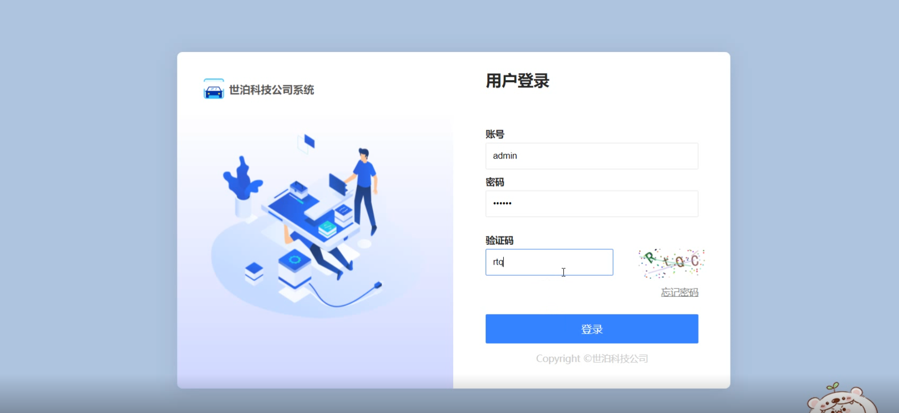
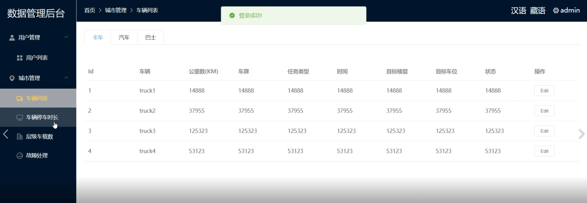
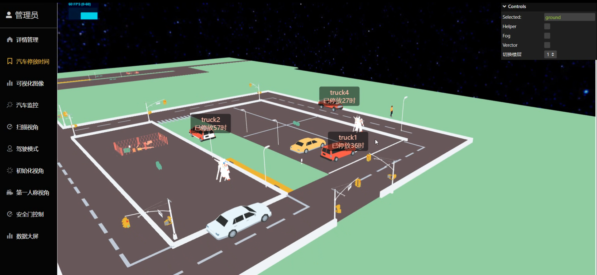
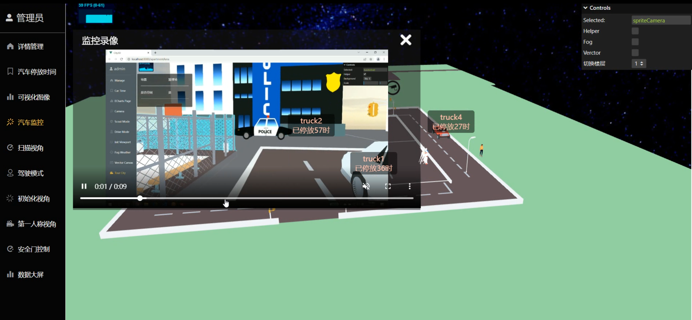
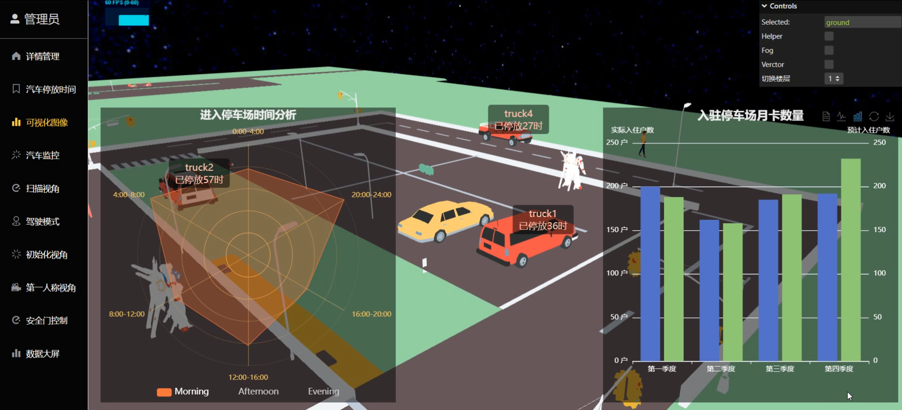
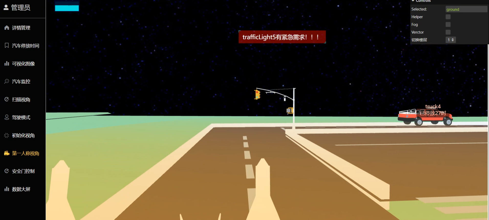
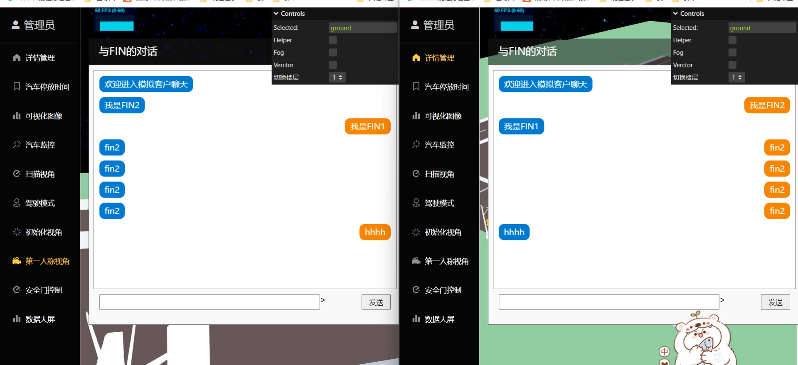

# threejs版本的控制系统（效果可以看readme文件夹下面的MP4文件）

## 功能1：最简单的登录注册，表格方面增删改查

这里满足用户最基本的功能，复现桌面c++的基本功能

 

## 功能2：3d效果之停车时间标签，监控功能，dashboard表格，扫描视角，第一人称

 

 

停车时间标签是为了更直观的看到各个车子停车的时间

 

 

监控功能是桌面c++的功能，在这个web端的应用我也将其搬了过来

 

 

这里的dashboard提供可视化管理表格，这里是我随便用echarts做了一下，这里的样式优化空间是很大的

 

 

扫描视角的想法我是在8.6号下午跟杨经理聊天的时候他提到的有一些报警和报错并不能很直观的显示出来，这里的扫描视角gif图片上虽然呈现的不多，但是我的源码上给样式等级设置了三个样式，根据传入的type级别分成info，warning，error等级。并且对应着3d场景的具体坐标

 

 
第一人称功能的功能是锦上添花，在我的构思中他可以在扫描想法中出作用，也可以在等一下功能的聊天功能中发挥作用。（又：第一人称其实是在开高达）
 

## 功能3：切换楼层+以车作为第一人称的效果

当时构思的时候，我觉得如果把整个楼做一个出来会有臃肿的情况出现，并且楼层之间的显示不直观，因此我设计了一个右上角的gui按钮，点击右上角就可以切换楼层。楼层和楼层之间做了一些简单的效果用以区别不同的楼层

 

以车作为第一人称的效果说实话可能用处并不大，但是我觉得可以加上去，只属于锦上添花的内容吧，没准以后会有用

 

 

## 功能4：安全门控制+数据大屏

 

安全门功能是桌面c++的功能，直接把他搬了过来

 

数据大屏还是起到一个直观看数据的作用吧，里面是一个3d模型和一个vr数据，可以转着浏览内部的信息。并且给出一些直观数据

## 功能5：实现聊天功能
 
这部分我使用express合socket简单写了一个后端，做这个的原因是可以让登录该系统的管理员进行一个简单的沟通

